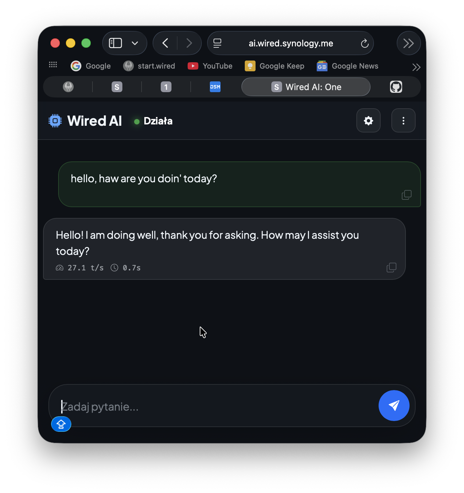

# 💎 Wired AI: One
**A Premium, Glassmorphic Web Interface for LM Studio and OpenAI-Compatible LLMs.**



Wired AI: One is an ultra-modern, containerized chat interface designed specifically for local LLM servers like **LM Studio**. It brings a sleek, high-end "Glassmorphism" aesthetic to your Homelab while providing deep integration with model status and performance metrics.

---

## ✨ Key Features
- **Sophisticated Design**: Stunning "Glassmorphism" UI with real-time blur/frost effects and responsive layouts optimized for any screen (mobile/tablet/desktop).
- **Intelligent Model Detection**: Automatically identifies which models are currently loaded in LM Studio and pre-selects them for a zero-config experience.
- **Performance-First**: Real-time tracking of **Tokens Per Second (TPS)** and Time to First Token (TTFT), persisted in your chat history.
- **PWA Support**: Installable as a native-feeling app on iOS, Android, and Desktop (Progressive Web App).
- **Modern Logic**: Built with Vanilla JS and Bootstrap 5 for maximum speed and minimal overhead. No heavy frameworks required.
- **Multilingual UI**: Seamless support for English and Polish (set via settings).
- **Privacy Centric**: All conversations stay on your local network. Optional password protection included.

---

## 🛠️ Installation

### 1. Using Docker Compose (Recommended)
The easiest way to deploy Wired AI is on your Synology NAS or any Docker-enabled host. **The container will automatically handle its own environment.**

```yaml
version: '3'
services:
  wired-ai:
    image: node:20-alpine
    container_name: wired-ai
    ports:
      - "8090:8090"
    volumes:
      - /path/to/your/wiredAI:/app
    environment:
      - PORT=8090
      - LLM_HOST=http://192.168.1.XX:1234  # URL to your LM Studio server
      - APP_PASSWORD=your_secret_pass    # Optional: set access password
      - REQUIRE_AUTH=true                 # Set to true to enable login
    working_dir: /app
    # Note: 'npm install' ensures all proxy dependencies are ready
    command: sh -c "npm install && node server.js"
    restart: unless-stopped
```

### 2. Local Manual Setup (Mac/PC/Linux)
1. Clone the repository: `git clone https://github.com/lehronn/wired.ai.git`
2. Install necessary proxy dependencies: `npm install`
3. Configure environment variables (or use `.env`).
4. Start the server: `npm start`

---

## ⚙️ Configuration Matrix

| Variable | Default | Description |
|----------|---------|-------------|
| `PORT` | `8090` | Port on which the web UI will be accessible. |
| `LLM_HOST` | `http://localhost:1234` | The host address where LM Studio / Local LLM is running. |
| `REQUIRE_AUTH` | `false` | Enable/Disable the simple password login screen. |
| `APP_PASSWORD` | `sezam` | Password for protected access (if enabled). |
| `LOG_LEVEL` | `info` | Control console output (debug, info, warn, error). |

---

## 📱 Progressive Web App (PWA)
Wired AI: One is PWA-ready. Simply open the app in your mobile browser:
1. **iOS (Safari)**: Tap the Share button and select **"Add to Home Screen"**.
2. **Android (Chrome)**: Tap the menu and select **"Install App"**.

It will function as a standalone app with a custom theme and no browser chrome.

---

## 🤝 Contributing
Contributions are welcome! Please feel free to submit Pull Requests or report issues.

## 📜 License
MIT License. Created by [lehronn](https://github.com/lehronn) for the Homelab community.
